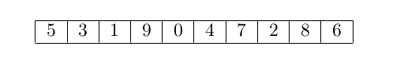
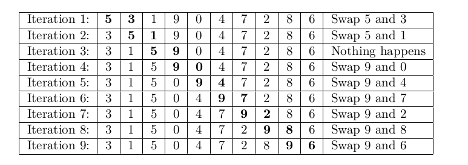
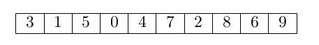

Algoritmos de ordenamiento
--------------------------

Muchos algoritmos eficientes se basan en ordenar los datos de entrada,
porque el ordenamiento a menudo facilita la resolución del problema.

El problema básico al ordenar es el siguiente: dado un arreglo que
contiene ``n`` elementos, ordena los elementos en orden creciente.

En esta sección repasaremos algunos algoritmos de ordenamiento
fundamentales y examinaremos sus propiedades. Es fácil diseñar un
algoritmo de ordenamiento temporal, pero también existen algoritmos más
eficientes.

Después de discutir la teoría de la ordenamiento, nos centraremos en el
uso de la ordenamiento en la práctica en C++.

Bubble sort
^^^^^^^^^^^

Bubble sort o `ordenamiento de
burbujas <https://yongdanielliang.github.io/animation/web/BubbleSortNew.html>`__
es un algoritmo de ordenamiento simple que funciona en el tiempo. El
algoritmo consta de :math:`n` rondas y en cada ronda se itera sobre los
elementos de un arreglo.

Siempre que se encuentran dos elementos consecutivos que están en orden
incorrecto, el algoritmo los intercambia. El algoritmo se puede
implementar de la siguiente manera:

.. code:: c++

    for (int i = 0; i < n; i++) {
        for (int j = 0; j < n-1; j++) {
            if (arreglo[j] > arreglo[j+1]) {
                swap(arreglo[j],arreglo[j+1]);
            }
        }
    }

Después de la primera ronda del ordenamiento de burbujas, el elemento
más grande estará en la posición correcta y, de manera más general,
después de ``k`` rondas, los ``k`` elementos más grandes estarán en las
posiciones correctas. Por lo tanto, después de ``n`` rondas, se ordenará
en todo el arreglo. Por ejemplo, las siguientes figuras muestran las
rondas de intercambios cuando se utiliza el ordenamiento de burbujas
para ordenar un arreglo.

Las iteraciones del método de ordenamiento de burbujas se muestran en la
tabla:

El arreglo resultante es:

El ordenamiento por burbujas es un ejemplo de un algoritmo de
ordenamiento que siempre intercambia elementos consecutivos en el
arreglo. Resulta que la complejidad temporal de dicho algoritmo es
siempre al menos :math:`O(n^2)` , porque en el peor de los casos, se
requieren $O(n^2) $ intercambios para ordenar el arreglo.

El programa siguiente lee un número :math:`n`
(:math:`1 \leq n \leq100`), que indica el número de elementos en el
arreglo :math:`X`. Los siguientes :math:`n` números representan los
elementos de :math:`X`.

El programa imprime el arreglo :math:`X` con sus elementos ordenados en
orden creciente.

.. code:: c++

    #include <algorithm>
    #include <cstdio>
    #define N 101
    using namespace std;
    int X[N];
    
    int n;
    
    void bubbleSort();
    int main() {
        scanf("%d", &n);
        for (int i = 0; i < n; i++) {
            scanf("%d", &X[i]);
        }
    
        bubbleSort();
    
        for (int i = 0; i < n; i++) {
            printf("%d ", X[i]);
        }
    
        printf("\n");
        return 0;
    }
    void bubbleSort() {
        for (int i = 0; i < n; i++) {
            for (int j = 0; j < n - 1; j++) {
                if (X[j] > X[j + 1]) {
                    swap(X[j], X[j + 1]);
                }
            }
        }
    }

Ejercicios
^^^^^^^^^^

1. Explica paso a paso el proceso del algoritmo de ordenamiento de
   burbuja con el arreglo :math:`[4, 2, 7, 1, 3]`.

2. ¿Qué crees que sucede si el arreglo tiene elementos repetidos?.

.. code:: c++

    // Tus respuestas

El mejor caso para la ordenación por burbujas ocurre cuando la lista ya
está ordenada o casi ordenada. En el caso de que la lista ya esté
ordenada, Bubble sort finalizará después de la primera iteración, ya que
no se realizaron intercambios.

**Inversiones**

Un concepto útil al analizar algoritmos de ordenamiento es una
inversión: un par de índices del arreglo ``(a, b)`` tales que
:math:`a < b` y ``arreglo[a] >arreglo[b]``, es decir, los elementos
están en orden incorrecto.

Ejemplos:

-  Entrada: ``A[] = [3, 2, 1]``

-  Los tres pares de inversiones son : ``(3, 2)``, ``(3, 1)``,
   ``(2, 1)``

-  Entrada: ``A[] = {6, 3, 5, 2, 7}``

-  Los cinco pares de inversiones son – (6, 3), (6, 5), (6, 2), (3, 2),
   (5, 2)

El número de inversiones indica cuánto trabajo se necesita para ordenar
el arreglo. Un arreglo está completamente ordenado cuando no hay
inversiones. Por otro lado, si los elementos del arreglo están en orden
inverso, el número de inversiones es:

.. math:: 1 + 2 + 3 + \cdots + (n -1) = \frac{n(n-1)}{2} = O(n^2)

que es el mayor posible.

Al intercambiar un par de elementos consecutivos que están en el orden
incorrecto, se elimina exactamente una inversión del arreglo. Por lo
tanto, si un algoritmo de ordenamiento solo puede intercambiar elementos
consecutivos, cada intercambio elimina como máximo una inversión y la
complejidad temporal del algoritmo es al menos :math:`O(n^2)`.

MergeSort
^^^^^^^^^

Si queremos crear un algoritmo de ordenamiento eficiente, debemos poder
reordenar los elementos que se encuentran en diferentes partes del
arreglo. Existen varios algoritmos de ordenamiento de este tipo que
funcionan en el tiempo :math:`O(n\log n)`. Uno de ellos es el de **merge
sort**, que se basa en la recursividad. Merge sort ordena un subarreglo
``arreglo[a,b]`` de la siguiente manera:

1. Si :math:`a =b`, no hagas nada, porque un subarreglo que solo
   contiene un elemento ya está ordenado.

2. Calcula la posición del elemento medio:
   :math:`k = \lfloor (a + b) /2 \rfloor` .

3. Ordena recursivamente el subarreglo ``arreglo[a...k]``.

4. Ordena recursivamente el subarreglo ``arreglo[k +1...b]``.

5. Fusiona el subarreglo ordenado ``arreglo[a...k]`` y el arreglo
   ``arreglo[k +1...b]`` en un subarreglo ordenado ``arreglo[a...b]``.

Veamos el proceso del algoritmo.

Por ejemplo, la figura anterior muestra cómo el merge sort ordena un
arreglo de ocho elementos. Primero, el algoritmo divide el arreglo en
dos arreglo de cuatro elementos. Luego, ordena estos subarreglos
recursivamente llamándose a sí mismo.

Finalmente, fusiona los subarreglos ordenados en un arreglo ordenada de
ocho elementos.

Ejemplo
^^^^^^^

Se muestra el proceso del algoritmo de Merge Sort del arreglo ``A`` y el
arreglo ``B`` en un arreglo ``C``, donde ``A`` y ``B`` se ordenan en
orden no decreciente.

Básicamente la idea del proceso consiste en colocar un iterador ``i``
(rojo) al inicio del arreglo ``A`` y un iterador ``j`` (azul) al inicio
del arreglo ``B``. Si :math:`A_i < B_j` el elemento :math:`A_i` se
inserta al final del arreglo ``C`` y ``i`` se mueve a la siguiente
posición.

De lo contrario, si :math:`A_i \geq B_j` el elemento :math:`B_j` se
inserta al final de :math:`C` y :math:`j` se mueve a la siguiente
posición.

El proceso continúa hasta que todos los elementos de ``A`` o ``B`` se
insertan en ``C``.

**Iteración 1**

**Iteración 2**

**Iteración 3**

**Iteración 4**

**Iteración 5**

**Iteración 6**

**Iteración 7**

**Iteración 8**

Una vez que uno de los iteradores llega al final del arreglo,
simplemente agregamos a ``C`` los elementos restantes del arreglo. Ahora
``C`` contiene todos los elementos de ``A`` y ``C`` en orden no
decreciente.

::

   C = [0, 1, 2, 5, 6, 7, 9, 10, 12, 16]

MergeSort es un algoritmo eficiente porque reduce a la mitad el tamaño
del subarreglo en cada paso. Luego, es posible fusionar los subarreglos
ordenados en tiempo lineal, porque ya están ordenados. Dado que hay
niveles recursivos y el procesamiento de cada nivel requiere un tiempo
total de :math:`O(n)`, el algoritmo funciona en el tiempo
:math:`O\log(n)`.

Una implementación
^^^^^^^^^^^^^^^^^^

.. code:: c++

    #include <cstdio>
    #define N 101
    using namespace std;
    
    int X[N], C[N];
    int n;
    
    void mergeSort(int, int);
    void merge(int, int, int);
    
    int main() {
        scanf("%d", &n);
    
        // Lee los numeros a ser ordenados
        for (int i = 0; i < n; i++) {
            scanf("%d", &X[i]);
        }
    
        // Aplicamos merge sort
        mergeSort(0, n - 1);
    
        // Imprimimos el arreglo ordenado
        for (int i = 0; i < n; i++) {
            printf("%d ", X[i]);
        }
        printf("\n");
    
        return 0;
    }

La función ``mergeSort`` recibe un intervalo de los elementos para
ordenar, calcula el elemento medio y recursivamente se vuelve a llamar
para ordenar ambas mitades del intervalo.

Finalmente se juntan ambas mitades ordenando todos los elementos del
intervalo.

.. code:: c++

    void mergeSort(int i, int j) {
     if (i != j) {
        int m = (i + j) / 2;
         mergeSort(i, m);
         mergeSort(m + 1, j);
         merge(i, m, j);
        }
    }

El proceso explicado anteriormente tiene lugar en la función ``merge``,
que recibe los índices ``i`` y ``j`` del intervalo a ordenar y el punto
medio ``m`` y ordena ambas mitades del arreglo.

.. code:: c++

    void merge(int i, int m, int j) {
        // p y q son los indices que se moverán a través 
        // de cada mitad respectivamente.
        int p = i;
        int q = m + 1;
        int r = i;
        // Sigue comparando los valores de X[p] y X[q] 
        // hasta llegar al final de una de las mitades
    
        while (p <= m && q <= j) {
            if (X[p] <= X[q]) {
              C[r++] = X[p++];
            } else {
              C[r++] = X[q++];
            }
        }
        
        //Agregamos los elementos restantes de la primera mitad.
        while (p <= m) {
            C[r++] = X[p++];
        }
    
        //Agregamos los elementos restantes de la segunda mitad.
        while (q <= j) {
            C[r++] = X[q++];
        }
    
        // Actualizamos el arreglo original
        for (r = i; r <= j; r++) {
          X[r] = C[r];
        }
    }

**Ejercicio:** Supongamos que recibes :math:`k` arreglos ordenados, cada
uno con :math:`n` elementos, y deseas combinarlos en un solo arreglo
ordenado de :math:`kn` elementos.

Un enfoque es usar la subrutina ``merge`` repetidamente, combinar los
dos primeros arreglos, luego combinar el resultado con el tercer
arreglo, luego con el cuarto arreglo y así sucesivamente hasta que se
combine en el arreglo de entrada enésima y final. ¿Cuál es el tiempo de
ejecución?

.. code:: c++

    // Tu respuesta

Ordenar el límite inferior
^^^^^^^^^^^^^^^^^^^^^^^^^^

¿Es posible ordenar un arreglo más rápido que :math:`O(n \log n)` en el
tiempo?

Resulta que esto no es posible cuando nos limitamos a algoritmos de
ordenamiento que se basan en la comparación de elementos de un arreglo.

El límite inferior de la complejidad temporal se puede demostrar
considerando el ordenamiento como un proceso en el que cada comparación
de dos elementos proporciona más información sobre el contenido del
arreglo. La figura ilustra el árbol creado en este proceso.

Aquí ``"x <y?"`` significa que se comparan algunos elementos ``x`` e
``y``. Si ``x < y`` el proceso continúa hacia la izquierda y en caso
contrario hacia la derecha. Los resultados del proceso son las posibles
formas de ordenar el arreglo, ¡un total de ``n!`` maneras. Por este
motivo, la altura del árbol debe ser al menos:

.. math:: \log_2(n!) = \log_2(1) + \log_2(2) + \cdots \log_2(n)

Obtenemos un límite inferior para esta suma eligiendo los últimos
:math:`n/2` elementos y cambiando el valor de cada elemento a
:math:`\log_2(n/2)`. Esto produce una estimación:

.. math:: \log_2(n!) \geq (n/2)\cdot \log_2(n/2)

por lo que la altura del árbol y el número de pasos en el peor de los
casos en un algoritmo de ordenamiento es :math:`\Omega(n\log n)`.

Counting sort
^^^^^^^^^^^^^

El límite inferior no se aplica a algoritmos que no comparan elementos
de un arreglo pero utilizan alguna otra información. Un ejemplo de tal
algoritmo es counting sort que ordena un arreglo en tiempo :math:`O(n)`
suponiendo que cada elemento del arreglo es un número entero entre
:math:`0 \dots c` y :math:`c = 0(n)`.

El algoritmo crea un arreglo contable, cuyos índices son elementos del
arreglo original. El algoritmo recorre en iteración el arreglo original
y calcula cuántas veces aparece cada elemento en el arreglo.

Como ejemplo, la figura muestra un arreglo y el arreglo contable
correspondiente. Por ejemplo, el valor en la posición ``3`` es ``2``,
porque el valor ``3`` aparece ``2`` veces en el arreglo original.

La construcción del arreglo contable lleva :math:`O(n)` veces. Después
de esto, el arreglo ordenado se puede crear en tiempo :math:`O(n)`,
porque el número de apariciones de cada elemento se puede recuperar del
arreglo contable. Por lo tanto, la complejidad temporal total de
counting sort es :math:`O(n)`.

Counting sort es un algoritmo muy eficiente, pero solo se puede usar
cuando la constante ``c`` es lo suficientemente pequeña, de modo que los
elementos del arreglo se puedan usar como índices en el arreglo
contable.

Revisa: `Counting Sort in C , C++, Java and
Python <https://www.mygreatlearning.com/blog/counting-sort/>`__.

**Repaso:** Estudia las demostraciones dados aquí:
https://homepages.bluffton.edu/~nesterd/apps/SortingDemo.html

Búsqueda binaria
~~~~~~~~~~~~~~~~

La búsqueda binaria es un algoritmo de tiempo que se puede utilizar, por
ejemplo, para comprobar de forma eficaz si un arreglo ordenado contiene
un elemento determinado.

En esta parte, primero nos centramos en la implementación de la búsqueda
binaria y después, veremos cómo se puede utilizar la búsqueda binaria
para encontrar soluciones óptimas a los problemas.

Implementación de la búsqueda
^^^^^^^^^^^^^^^^^^^^^^^^^^^^^

Supongamos que tenemos un arreglo ordenado de ``n`` elementos y queremos
verificar si el arreglo contiene un elemento con un valor objetivo
``x``.

A continuación analizamos dos formas de implementar un algoritmo de
búsqueda binaria para este problema.

**Primer método** La forma más común de implementar la búsqueda binaria
se asemeja a buscar una palabra en un diccionario. La búsqueda mantiene
un subarreglo activo en el arreglo, que inicialmente contiene todos los
elementos del arreglo. Luego, se realizan una serie de pasos, cada uno
de los cuales reduce a la mitad el rango de búsqueda. En cada paso, la
búsqueda comprueba el elemento central del subarreglo activo. Si el
elemento central tiene el valor objetivo, la búsqueda finaliza. De lo
contrario, la búsqueda continúa recursivamente hacia la mitad izquierda
o derecha del subarreglo, dependiendo del valor del elemento central.

Esta es la forma tradicional de implementar la búsqueda binaria. En cada
paso verificamos el elemento central del subarreglo activo y procedemos
a la parte izquierda o derecha.

Por ejemplo, la figura muestra cómo se encuentra un elemento con valor
``9`` en el arreglo.

En cada paso verificamos el elemento central del subarreglo activo y
procedemos a la parte izquierda o derecha.

La búsqueda se puede implementar de la siguiente manera:

.. code:: c++

    int a = 0, b = n-1;
    while (a <= b) {
        int k = (a+b)/2;
        if (arreglo[k] == x) {
            // x encontrado en el indice k
        }
        if (arreglo[k] < x) a = k+1;
        else b = k-1;
    }

En esta implementación, el rango del subarreglo activo es y el rango
inicial es :math:`a...b` y el rango inicial es :math:`0...n -1`. El
algoritmo reduce a la mitad el tamaño del subarreglo en cada paso, por
lo que la complejidad temporal es :math:`O(\log n)`.

**Segundo Método** Otra forma de implementar la búsqueda binaria es
recorrer el arreglo de izquierda a derecha dando *saltos*. La longitud
del salto inicial es :math:`n/2` y la longitud del salto se va
reduciendo a la mitad en cada paso: primero :math:`n/4`, luego
:math:`n/8`, luego :math:`n/16`, etc., hasta que finalmente la longitud
es 1.

En cada iteración, se salta hasta que terminemos fuera del arreglo o en
un elemento cuyo valor exceda el valor objetivo. Tras los saltos o se ha
encontrado el elemento deseado o sabemos que no aparece en el arreglo.

La figura ilustra la técnica en un escenario de ejemplo.

El siguiente código implementa la búsqueda:

.. code:: c++

    int k = 0;
    for (int b = n/2; b >= 1; b /= 2) {
        while (k+b < n && arreglo[k+b] <= x) k += b;
    }
    if (arreglo[k] == x) {
    // x encontrado en el indice k
    }

Durante la búsqueda, la variable ``b`` contiene la longitud del salto
actual. La complejidad temporal del algoritmo es :math:`O(\log n)` ,
porque el código en el bucle while se ejecuta como máximo dos veces para
cada longitud de salto.

Forma práctica
^^^^^^^^^^^^^^

Las complejidades logarítmicas :math:`\log n` son importantes por un par
de razones. En primer lugar, son una complejidad deseable a la hora de
diseñar una función, ya que la eficiencia de las funciones
:math:`O(\log n)` es cercana a la de las funciones :math:`O(1)`. En
segundo lugar, se trata de una complejidad común en tiempo de ejecución,
por lo que es importante poder reconocerlas.

Los ejemplos incluyen búsquedas binarias, encontrar el valor más pequeño
o más grande en un árbol de búsqueda binaria y ciertos algoritmos de
divide y vencerás.

Veamos el ejemplo de la búsqueda binaria. Si queremos encontrar un valor
en un arreglo ordenado, podríamos simplemente iterarlo hasta encontrar
el valor, pero es posible que tengamos que recorrer toda el arreglo.

Una búsqueda binaria ofrece un método más eficiente.

Estos son los pasos del pseudocódigo por los que pasa una búsqueda
binaria que hemos explorado anteriormente:

1. Establece dos variables: ``min = 0`` y ``max = n - 1``.
2. Encuentra el valor medio entre el mínimo y el máximo promediando el
   mínimo y el máximo y redondeándolo hacia abajo.
3. Si ``arr[medio] === objetivo`` return ``medio``.
4. Si ``arr[medio] <objetivo``, establece ``min = medio + 1``.
5. De lo contrario, establece ``max = medio - 1``.
6. Vuelve al paso 2.

Eso suena bastante simple, pero veamos cómo se desarrolla con un arreglo
real y un valor objetivo.

Sea el ``arr = [4, 8, 10, 14, 27, 31, 46, 52]`` y nuestro objetivo es
``46``.

Entonces,

-  ``min = 0, max = 7`` y ``medio = (0 + 7)/2 = 3.5`` -> redondear a
   ``3``
-  ``arr[3] = 14`` y por lo tanto menos de ``46``, entonces
   ``min = medio+ 1 = 4``
-  ``min = 4, max = 7`` y ``medio = (4 + 7)/2 = 5.5`` -> redondear a
   ``5``
-  ``arr[5] = 31`` y por lo tanto menos de ``84`` entonces
   ``min = medio + 1 = 6``
-  ``min = 6, max = 7`` y ``medio = (6 + 7)/2 = 6.5`` -> redondear a
   ``6``
-  ``arr[6] = 46``, ¡lo que equivale al objetivo! .
-  Regreso al medio.

En el ejemplo pudimos encontrar el valor objetivo en solo ``3``
iteraciones del código. El algoritmo de búsqueda binaria logra esto
dividiendo el área de búsqueda por la mitad en cada iteración. Entonces
al principio tenemos ``n`` elementos para buscar. En el segundo paso
solo tenemos ``n/2`` elementos para buscar y en el tercero solo tenemos
``n/4`` elementos para buscar.

En el caso anterior que se ve así,

-  ``N = 8, [4, 8, 10, 14, 27, 31, 46, 52]`` // Comparamos y dividimos
   el área de búsqueda por 2
-  ``N = 4, [27, 31, 46, 52]`` // Comparamos y dividimos el área de
   búsqueda por 2
-  ``N = 2, [46, 52]`` // Comparamos el valor medio y el objetivo.
   Coinciden, así que regresamos a la mitad.

Todo esto tomó tres pasos y se divide por 2 cada vez. Si multiplicamos
por 2 cada vez tendríamos :math:`2 \times 2 \times 2 = 8`, o
:math:`2^3 = 8`.

.. math:: 2^3 = 8 -> \log_2 8 = 3

.. math:: 2^k = n -> \log_2 n = k

Entonces podemos ver que dado que el código se dividía por ``2`` cada
vez y comenzamos con ``n`` elementos en el arreglo ordenado, se
necesitarán :math:`\log n` iteraciones del algoritmo de búsqueda binaria
para encontrar el valor objetivo. Por lo tanto, la complejidad de una
búsqueda binaria es :math:`O(\log n)`.

Si un algoritmo divide los elementos que se consideran entre 2 en cada
iteración, entonces probablemente tenga una complejidad de tiempo de
ejecución de :math:`O(\log n)`.

Encontrar soluciones óptimas
^^^^^^^^^^^^^^^^^^^^^^^^^^^^

Supongamos que estamos resolviendo un problema y tenemos una función
``valid(x)`` que devuelve ``true`` si ``x`` es una solución válida y
``false`` en caso contrario. Además, sabemos que ``valid`` es ``false``
cuando :math:`x < k` y ``true`` cuando :math:`x\geq k`. En esta
situación, podemos utilizar la búsqueda binaria para encontrar
eficientemente el valor de ``k``.

La idea es realizar una búsqueda binaria del valor más grande de ``x``
para el cual ``valid(x)`` sea ``false``. Por lo tanto, el siguiente
valor ``k = x +1`` es el valor más pequeño posible para el cual
``valid(x)`` sea ``true``.

La búsqueda se puede implementar de la siguiente manera:

.. code:: c++

    int x = -1;
    for (int b = z; b >= 1; b /= 2) {
        while (!valid(x+b)) x += b;
        }
    int k = x+1;

La longitud del salto inicial ``z`` tiene que ser un límite superior
para la respuesta, es decir, cualquier valor para el cual sabemos con
seguridad que ``valid(z)`` es ``true``. El algoritmo llama a la función
``valid(z)`` :math:`O(\log z)` veces, por lo que el tiempo de ejecución
depende de la función ``valid``.

Por ejemplo, si la función funciona en tiempo :math:`O(n)`, el tiempo de
ejecución es :math:`O(n \log z)`.

Ejercicio
^^^^^^^^^

Escribe una implementación del algoritmo de búsqueda binaria de manera
iterativa y recursiva.

.. code:: c++

    // Tu respuesta

