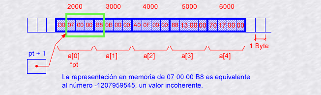

Punteros y referencias
----------------------

En clases anteriores, las variables se han explicado como ubicaciones en
la memoria de la computadora a las que se puede acceder mediante su
identificador (su nombre). De esta manera, el programa no necesita
preocuparse por la dirección física de los datos en la memoria, ya que
simplemente usa el identificador cada vez que necesita referirse a la
variable.

Un **puntero** es una variable que apunta a otra variable. Los punteros
tienen un tipo; es decir, un puntero a ``int`` apunta o se refiere a un
``int``. Un puntero a ``char`` se refiere a un ``char``. Un puntero a
``int`` se puede asignar a otro puntero a ``int``, pero no a un puntero
a ``char``. Un puntero a la clase ``f1`` se refiere a una instancia de
la clase ``f1``.

Un puntero también puede ser el valor especial ``nullptr``, lo que
significa que el puntero no apunta a nada. Una ``referencia`` es un
puntero, pero con restricciones que hacen que su uso sea más seguro.

Los punteros de C++ pueden apuntar a cualquier variable dentro de
cualquier estructura de datos y pueden iterar en los elementos del
arreglos. Para que los punteros sean eficientes, C++ no hace nada para
verificar si un puntero se refiere a una ubicación de memoria válida que
contiene una variable del mismo tipo que el puntero. Esto significa que
los punteros pueden causar estragos, sobrescribiendo inesperadamente
datos en un programa que no los usa con cuidado.

Debido a que los punteros y las referencias pueden apuntar a otras
estructuras de datos, usar un puntero es un atajo que elimina la
necesidad de escribir código repetidamente para acceder a los datos.
Esto también puede dar a C++ una ventaja de velocidad sobre otros
lenguajes.

Direcciones de memoria
~~~~~~~~~~~~~~~~~~~~~~

Para un programa C++, la memoria de una computadora es como una sucesión
de celdas de memoria de un solo byte, cada una con una dirección única.
Estas celdas de memoria están ordenadas de manera que permiten que las
representaciones de datos de más de un byte ocupen celdas de memoria que
tienen direcciones consecutivas. Esta ordenación permite localizar
fácilmente cada celda en la memoria por medio de su dirección única. Por
ejemplo, la celda de memoria con la dirección ``1776`` siempre sigue
inmediatamente después de la celda con la dirección ``1775`` y precede a
la que tiene ``1777`` y está exactamente mil celdas después de ``776`` y
exactamente mil celdas antes de ``2776``.

Cuando se declara una variable, a la memoria necesaria para almacenar su
valor se le asigna una ubicación específica en la memoria, conocida como
su **dirección**. Generalmente, los programas de C++ no deciden
activamente las direcciones de memoria exactas donde se almacenan sus
variables. Esa tarea se deja al entorno donde se ejecuta el programa,
generalmente, un sistema operativo que decide las ubicaciones de memoria
particulares en tiempo de ejecución. Sin embargo, puede ser útil que un
programa pueda obtener la dirección de una variable durante el tiempo de
ejecución para acceder a las celdas de datos que se encuentran en una
determinada posición con respecto a ella.

El siguiente diagrama muestra una región de la memoria como una cinta
larga que se extiende de izquierda a derecha. Los números hexadecimales
sobre la cinta son direcciones de memoria.

Los bytes de memoria no tienen un significado fijo hasta que el programa
declara una variable.

Operador address-of &
~~~~~~~~~~~~~~~~~~~~~

La dirección de memoria de una variable se puede obtener precediendo el
nombre de una variable con un signo &, conocido como operador de
dirección.

Por ejemplo:

.. code:: c++

    f1 = &myvar;

Esta declaración asignará la dirección de la variable ``myvar`` a
``f1``. Al preceder el nombre de la variable ``myvar`` con el ampersand,
ya no estamos asignando el contenido de la variable en sí a ``f1``, sino
su dirección de memoria.

Supongamos que ``myvar`` se coloca en tiempo de ejecución en la
dirección de memoria ``1776``. En este caso, considera el siguiente
fragmento de código:

.. code:: c++

    myvar = 25; 
    f1 = &myvar; 
    bar = myvar; 

Primero, le hemos asignado el valor ``25`` a ``myvar`` (una variable
cuya dirección en memoria asumimos que es ``1776``). La segunda
declaración asigna la dirección de ``myvar (1776)``, en lugar del valor
de ``myvar``, a ``f1``. Finalmente, la tercera declaración asigna el
valor contenido en ``myvar`` a ``bar``. Esta es una operación de
asignación normal.

Una variable que almacena la dirección de otra variable, ``f1`` en este
ejemplo, se llama puntero.

Punteros
~~~~~~~~

Un puntero es una variable que contiene la dirección de otra variable.
Es decir, un puntero apunta a otra variable. Los punteros se declaran
con el nombre del tipo y un asterisco ``*``. Entonces, para declarar un
puntero llamado ``ptr`` a una variable ``int``, la declaración se ve
como ``int* ptr``.

El operador ``& address-of`` produce la dirección del argumento,
convirtiendo una variable en un puntero a esa variable. Si ``i1`` es una
variable ``int``, entonces ``&i1`` es un puntero a ``int`` que apunta a
``i1``. El operador ``&`` puede leerse como ``toma la dirección de...``.

El efecto del operador ``address-of`` puede verse consultando el
siguiente diagrama:

Operador de desreferencia \*
~~~~~~~~~~~~~~~~~~~~~~~~~~~~

Hemos visto cómo usar un puntero para almacenar la dirección de otra
variable. Los punteros se denominan así porque “apuntan a” la variable
cuya dirección almacenan. Una propiedad interesante de los punteros es
que también se pueden usar para acceder al valor de la variable a la que
apuntan. Esto se hace precediendo el nombre del puntero con el operador
de desreferencia ``*``. El operador en sí puede leerse como “valor
apuntado por”.

La siguiente declaración establece la variable ``baz`` igual al
``"valor señalado por f1"``:

.. code:: c++

    baz = *f1; 

Esta declaración en realidad asignaría el valor ``25`` a ``baz``, ya que
``f1`` es ``1776`` y el valor almacenado en la dirección ``1776``
(usando el ejemplo anterior) sería ``25``.

Es importante diferenciar claramente que ``f1`` hace referencia al valor
``1776``, mientras que ``*f1`` hace referencia al valor almacenado en la
dirección ``1776``, que en este caso es ``25``. Fíjate en la diferencia
de incluir o no incluir el operador de desreferencia:

.. code:: c++

    baz = f1; // baz igual a f1 (1776) 
    baz = *f1; // baz igual al valor apuntado por f1 (25)

Los operadores de referencia y desreferencia son, por tanto,
complementarios:

-  ``&`` es la dirección del operador, y puede leerse simplemente como
   “dirección de”
-  ``*`` es el operador de desreferencia y puede leerse como “valor
   señalado por”

Anteriormente, realizamos las siguientes dos operaciones de asignación:

.. code:: c++

    myvar = 25; 
    f1 = &myvar; 

Inmediatamente después de estas dos declaraciones, todas las siguientes
expresiones darían como resultado verdadero:

.. code:: c++

    myvar == 25 
    &myvar == 1776 
    f1 == 1776 
    *f1 == 25 
    *f1 == myvar 

La primera expresión es bastante clara, considerando que la operación de
asignación realizada en ``myvar`` fue ``myvar = 25``. La segunda utiliza
el operador ``address-of &``, que devuelve la dirección de ``myvar``,
que asumimos que tiene un valor de ``1776``. La tercera es algo obvio,
ya que la segunda expresión era verdadera y la operación de asignación
realizada en ``f1`` era ``f1 = &myvar``. La cuarta expresión utiliza el
operador de desreferencia ``*`` para obtener el valor al que apunta
``f1`` y, de hecho, es ``25``. La expresión final es verdadera siempre
que la dirección a la que apunta ``f1`` sea la dirección de ``myvar``.

Ejemplo: Punteros
~~~~~~~~~~~~~~~~~

En este ejemplo, escribiremos un programa muy simple que crea un
puntero, se establece para que apunte a un ``int`` y luego cambia el
valor del ``int`` a través del puntero. El programa ilustra la sintaxis
de las declaraciones y asignaciones de punteros. El programa también
imprimirá el valor del puntero y la dirección del ``int``, para
demostrar que son iguales, y el valor del ``int`` antes y después de
cambiarlo a través del puntero, para comprobar que ha cambiado.

Estos son los pasos para completar el ejemplo:

1 . Primero, ingresa el esqueleto de la función ``main()``:

.. code:: c++

    #include <iostream>
    using namespace std;
    int main()
    {
        return 0;
    }

2 . En la función ``main()``, declara una variable ``int``, ``i``, que
inicialice en ``12345``:

.. code:: c++

    int i = 12345;

3 . Declara un puntero a la variable ``int`` ``p`` y inicializa para que
apunta a ``int``:

.. code:: c++

    int *p = &i;

4 . Muestra el valor del puntero y la dirección de la variable ``int``:

.. code:: c++

    cout << "p = " << p << ", &i = " << &i << endl;

Las direcciones hexadecimales específicas impresas pueden cambiar de un
compilador a otro y de una ejecución a otra, pero el punto es que los
dos números son iguales; es decir, el puntero apunta a ``int``.

5 . Muestra el valor de la variable ``int``, ``i``:

.. code:: c++

    cout << "i = " << i << endl;

6 . Usa el operador ``*`` para desreferenciar el puntero, produciendo el
``int`` apuntado. Luego, agregue ``2`` al valor y guárdelo nuevamente:

.. code:: c++

    *p = *p + 2;

7 . Finalmente, imprima el valor para demostrar que agregar ``2`` al
puntero desreferenciado también agregó ``2`` al ``int``:

.. code:: c++

    cout << "i = " << i << endl;

8 . Compila y ejecuta el programa.

.. code:: c++

    #include <iostream>
    using namespace std;
    int main()
    {
        int i = 12345;
        int *p = &i;
        cout << "p = " << p << ", &i = " << &i << endl;
        
        cout << "i = " << i << endl;
        *p = *p + 2;
        cout << "i = " << i << endl;
        
        return 0;
    }

Las direcciones hexadecimales que se muestran en este resultado pueden
ser diferentes en tu ejecución de la mía. Eso se espera. Lo importante
es que las dos direcciones serán la misma. Después de asignar un nuevo
valor al puntero desreferenciado, el valor de int cambió, también como
se esperaba.

Ejemplo: Desreferenciar nullptr
~~~~~~~~~~~~~~~~~~~~~~~~~~~~~~~

La desreferenciación de ``nullptr`` provoca un error en el tiempo de
ejecución y detiene el programa. Desreferenciar ``nullptr`` no es algo
que un programador haga deliberadamente. Es algo que sucede por
accidente cuando alguna ruta de ejecución a través del programa no
inicializa el puntero a una dirección de máquina válida antes de que se
use el puntero.

Inicializar cada puntero a ``nullptr`` produce un mensaje de error
particular, mientras que desreferenciar a un puntero no inicializado
puede causar errores más sutiles.

Aquí hay algunos pasos que puede realizar para ver esto en acción:

1 . Escribe el siguiente programa:

.. code:: c++

    #include <iostream>
    using namespace std;
    int main()
    
    {
        int *p1 = nullptr;
        cout << "p1 = " << p1 << endl;
        *p1 = 22;
        return 0;
    }

¿Qué sucede en la ejecución ? Si estás utilizando un compilador en línea
y el compilador en línea en particular utilizado no muestra un mensaje
de error, prueba con un compilador diferente.

Declaración de punteros
~~~~~~~~~~~~~~~~~~~~~~~

Dado que un puntero puede hacer referencia al valor de la variable a la
que apunta (desreferenciando), un puntero debe saber el tipo de variable
a la que apunta. No basta con saber que apunta a una dirección de
memoria anónima. Esto significa que la declaración del puntero debe
incluir el tipo de datos al que apunta. La declaración de punteros sigue
esta sintaxis:

.. code:: c++

    tipo * nombre;

En la declaración, ``tipo`` es el tipo de datos al que apunta el
puntero. Este no es el tipo del puntero en sí, sino el tipo de los datos
a los que apunta el puntero. Por ejemplo:

.. code:: c++

    int *number;
    char *character;
    double *decimals;

Estas son tres declaraciones de punteros. Aunque cada uno apunta a un
tipo de datos diferente, son punteros y todos usan la misma cantidad de
espacio en la memoria (el tamaño en la memoria de un puntero depende de
la plataforma donde se ejecuta el programa). Sin embargo, los datos a
los que apuntan no ocupan la misma cantidad de espacio, ni son del mismo
tipo. Ten en cuenta que el asterisco ``*`` utilizado al declarar un
puntero no debe confundirse con el operador de desreferencia.

**Ejercicios**

Explica la salida de ambos ejemplos.

.. code:: c++

    #include <iostream>
    using namespace std;
    
    int main()
    {
      int primerValor, segundoValor;
      int * miPuntero;
    
      miPuntero = &primerValor;
      *miPuntero = 10;
      miPuntero = &segundoValor;
      *miPuntero = 20;
      cout << "primerValor es " << primerValor << endl;
      cout << "segundoValor es " << segundoValor << endl;
      return 0;
    }

.. code:: c++

    #include <iostream>
    using namespace std;
    
    int main()
    {
      int primerValor = 5, segundoValor = 15;
      int * p1, * p2;
    
      p1 = &primerValor;  
      p2 = &segundoValor; 
      *p1 = 10;         
      *p2 = *p1;        
      p1 = p2;           
      *p1 = 20;      
      
      cout << "primerValor es " << primerValor << endl;
      cout << "segundoValor es " << segundoValor << endl;
      return 0;
    }

Observa la siguiente línea:

.. code:: c++

    int  *p1, *p2; 

Esta declara los dos punteros ``p1`` y ``p2`` en una sola línea, pero
requiere un ``*`` para que cada variable sea un puntero. Si, en cambio,
el código fuera:

.. code:: c++

    int *p1, p2;

Terminaría con un puntero ``p1`` y ``p2`` sería de tipo ``int``. Los
espacios no importan en absoluto para este propósito. Para evitar este
tipo de ambigüedad, es una buena práctica declarar una variable por
línea:

.. code:: c++

    int *p1;
    int *p2;

Punteros a arreglos
~~~~~~~~~~~~~~~~~~~

Los arreglos y los punteros son casi indistinguibles entre sí en C++. Un
arreglo siempre se puede convertir implícitamente en el puntero del tipo
adecuado. Por ejemplo, considera estas dos declaraciones:

.. code:: c++

    int myarray[20];
    int *mypointer;

La siguiente operación de asignación sería válida:

.. code:: c++

    mypointer = myarray;

Después de ejecutar esta declaración, ``mypointer`` y ``myarray`` serían
equivalentes y, de hecho, tendrían propiedades muy similares. La
variable ``mypointer`` se puede usar para hacer referencia a elementos
del arreglo, y la variable ``myarray`` se puede deferenciar como un
puntero. De hecho, la única diferencia es que a ``mypointer`` se le
puede asignar un valor, mientras que a ``myarray`` no, por lo que no se
permite la siguiente asignación:

.. code:: c++

    myarray = mypointer;

**Ejercicio**

Explica la salida del siguiente ejemplo.

.. code:: c++

    #include <iostream>
    using namespace std;
    
    int main()
    {
      int numbers[5];
      int *p;
      p = numbers;
      *p = 10;
      p++;  
      *p = 20;
      p = &numbers[2];  
      *p = 30;
      p = numbers + 3;  
      *p = 40;
      p = numbers;  
      *(p+4) = 50;
      for (int n=0; n<5; n++)
        cout << numbers[n] << ", ";
      cout << endl;
      return 0;
    }

Un puntero al comienzo de un arreglo, la dirección del primer elemento y
el nombre del arreglo significan lo mismo.

Los elementos del arreglo son variables. El operador ``&`` se puede usar
para obtener la dirección de un elemento del arreglo para asignarlo a un
puntero. La expresión ``p = &a[2]``, actualiza ``p`` para apuntar a la
tercera entrada del arreglo ``a`` (recuerda, los arreglos comienzan
desde cero).

Un puntero funciona como un arreglo en C++. Si ``p`` apunta a ``a[2]``,
entonces la expresión ``p[3]`` busca la sexta entrada en el arreglo (es
decir, la que está en ``a[5]``).

Ejemplo: Punteros a arreglos
~~~~~~~~~~~~~~~~~~~~~~~~~~~~

En este sencillo ejemplo, configuramos un puntero para que apunte a un
elemento el arreglo y probaremos que apunta al valor esperado. Recuerda
que los arreglos comienzan en cero en C++, por lo que ``a[5]`` es el
sexto elemento.

Estos son los pasos para completar el ejercicio:

1 .Ingresa la función esqueleto ``main()``, de la siguiente manera:

.. code:: c++

    #include <iostream>
    using namespace std;
    int main()
    {
        return 0;
    }

2 . Siguiendo la llave de apertura de ``main()``, declara un arreglo de
``7`` ``ints`` llamado ``a``, e inicializalo. Luego, declara un puntero
a ``int`` llamado ``p``, y configúrelo en ``nullptr`` para que sepamos
que no tiene una dirección conocida:

.. code:: c++

    int a[7]{ 1, 3, 5, 4, 2, 9, -1 };
    int *p = nullptr;

3 . Ahora, establece ``p`` en la dirección de ``a[2]`` usando el
operador ``& address-of`` para conocer la dirección del elemento del
arreglo:

.. code:: c++

    p = &a[2];

4 . Muestra el puntero desreferenciado, ``*p``, y el valor de ``a[2]``
para ver que el puntero apunta realmente a ``a[2]``:

.. code:: c++

    cout << "*p = " << *p << ", a[2] = " << a[2] << endl;

5 . A continuación, genera ``p[3]`` y ``a[5]``. Esto muestra que los
punteros se pueden subscribir como arreglos, y que ``p[3]`` apunta al
mismo valor que ``a[5]``:

.. code:: c++

    cout << "p[3] = " << p[3] << ", a[5] = " << a[5] << endl;

6 . El programa completo se ve así:

.. code:: c++

    #include <iostream>
    using namespace std;
    int main()
    {
        int a[7] {1, 3, 5, 4, 2, 9, -1};
        int * p = nullptr;
        
        p = & a[2];
        cout << "*p = " << * p << ", a[2] = " << a[2] << endl;
        cout << "p[3] = " << p[3] << ", a[5] = " << a[5] << endl;
        
        return 0;
    }

7 . Compila y ejecuta el programa.

Inicialización de puntero
~~~~~~~~~~~~~~~~~~~~~~~~~

Los punteros se pueden inicializar para señalar ubicaciones específicas
cuando se definen:

.. code:: c++

    int myvar; 
    int *myptr = &myvar; 

El estado resultante de las variables después de este código es el mismo
que después de lo siguiente:

.. code:: c++

    int myvar;
    int * myptr; 
    myptr = &myvar; 

Los punteros se pueden inicializar en la dirección de una variable (como
en el caso anterior) o en el valor de otro puntero (o arreglo):

.. code:: c++

    int myvar; 
    int *f1 = &myvar; 
    int *bar = f1; 

Aritmética de punteros
~~~~~~~~~~~~~~~~~~~~~~

Las operaciones de suma y resta en punteros funcionan de forma
ligeramente diferente a los tipos de enteros normales, ya que depende
del tamaño del tipo de datos al que apuntan. Podemos ver este
comportamiento usando el siguiente ejemplo que define tres punteros a
tipos de diferentes tamaños:

.. code:: c++

    char *mychar;
    short *myshort;
    long *mylong;

Supongamos que apuntan a las ubicaciones de memoria ``1000``, ``2000`` y
``3000``, respectivamente y ejecutan las siguientes instrucciones:

.. code:: c++

    ++mychar;
    ++myshort;
    ++mylong;

Encontraríamos que ``mychar`` contiene el valor ``1001``, ``myshort``
contiene el valor ``2002`` y ``mylong`` contiene el valor ``3004``,
aunque cada uno de ellos se incrementó solo una vez. La razón es que, al
agregar uno a un puntero, se hace que el puntero apunte al siguiente
elemento del mismo tipo. Para lograr esto, se agrega al puntero el
tamaño (en bytes) del tipo al que apunta.

Esto es aplicable tanto al sumar como al restar punteros con cualquier
número.

Los operadores de incremento ``++`` y decremento ``--`` se usan
comúnmente con punteros, ya que proporcionan una manera conveniente de
mover el puntero al valor anterior o siguiente, respectivamente.
Recuerda que pueden usarse como prefijo o como postfijo de una
expresión. Cuando se usan con punteros, esto puede tener una sutil
diferencia, ya que el resultado de la operación de prefijo es el nuevo
valor, mientras que el resultado de la operación popstfijo es el valor
anterior.

Las siguientes operaciones son equivalentes:

.. code:: c++

    *p++ 
    *(p++) 

Esta operación aumentará el valor de ``p`` (por lo que ahora apunta al
siguiente elemento), pero debido a que ``++`` se usa en forma de
postfijo, la expresión ``p++`` se evalúa como el valor señalado antes de
incrementarse. Esto significa que ``*p++`` hace referencia a la
ubicación antes del incremento. Básicamente, estas son las cuatro
combinaciones posibles del operador de desreferencia con las versiones
de prefijo y postfijo del operador de incremento (lo mismo se aplica al
operador de decremento):

.. code:: c++

    *p++ // igual que *(p++): puntero de incremento y dirección no incrementada de referencia 
    *++p // igual que *(++p): puntero de incremento y dirección incrementada desreferenciada 
    ++*p // igual que ++(*p): desreferenciar el puntero e incrementar el valor al que apunta
    (*p)++ // desreferenciar el puntero y post-incrementar el valor al que apunta 

Ten en cuenta que se requieren paréntesis en el último caso ya que los
operadores ``++`` (y ``--``) tienen mayor precedencia que ``*``, por lo
que se aplican primero a la expresión.

Múltiples operadores se pueden combinar en una sola declaración como la
siguiente:

.. code:: c++

    *p++ = *q++; 

El valor asignado a ``*p`` es ``*q`` antes de que tanto ``p`` como ``q``
se incrementen, luego ambos se incrementan. es equivalente a:

.. code:: c++

    *p = *q;
     ++p; 
    ++q;

C++ convierte el nombre de un arreglo en un puntero ``a[0]``, la primera
entrada del arreglo. El enunciado ``p = a``; donde ``a`` es un arreglo,
actualiza ``p`` para que apunte a la primera entrada en ``a``.

El programa puede agregar uno a un puntero. Si el puntero apunta a un
arreglo, el resultado de ``p+1`` es un puntero al siguiente elemento del
arreglo. El valor de dirección hexadecimal del puntero cambia según el
tamaño en bytes de un elemento del arreglo.

El programa puede agregar el valor de cualquier expresión integral a un
puntero, lo que produce un puntero que avanza esa cantidad de elementos.
Si ``p`` es un puntero y ``k`` es un ``int``, entonces la expresión de
puntero ``p+k`` es un puntero del mismo tipo que ``p``.

El programa puede restar un puntero de otro si apuntan al mismo arreglo.
El resultado es el número de elementos del arreglo entre los dos
punteros. El resultado de restar punteros no se puede interpretar si los
dos punteros no apuntan al mismo arreglo.

El programa puede comparar dos punteros si apuntan al mismo arreglo,
utilizando cualquiera de los operadores relacionales (como
``==, !=, <, >, <=`` y ``>=``). Si los punteros apuntan a arreglos
diferentes, se produce una respuesta sin sentido.

Ejemplo: Aritmética de punteros
~~~~~~~~~~~~~~~~~~~~~~~~~~~~~~~

En este ejemplo demuestra cómo funcionan la aritmética de punteros y los
operadores relacionales de punteros, y también te familiariza con la
interpretación de expresiones de punteros.

Estos son los pasos para completar el ejercicio:

1.Ingresa a la función esqueleto ``main()``. Puedes ejecutar el programa
después de cada paso, o esperar hasta que esté todo ingresado para
ejecutarlo:

.. code:: c++

    #include <iostream>
    using namespace std;
    int main()
    {
        return 0;
    }

2 . Siguiendo la llave de apertura de ``main()``, declara un arreglo de
cinco enteros llamados ``numbers``. Declara un puntero a ``int`` llamado
``pint`` e inicialícelo a ``numbers``. Declara otro puntero a ``int``
llamado ``p2`` e inicializarlo para que apunte a ``numbers[3]``:

.. code:: c++

    int numbers[5]{ 0, 100, 200, 300, 400 };
    int* pint = numbers;
    int* p2 = &numbers[3];

3 . A continuación, genera el valor de ``pint``, el valor de la
expresión de puntero ``pint+1`` y ``sizeof(int)``, que te indica cuántos
bytes de memoria ocupa un ``int`` en esta máquina. Aunque los valores
hexadecimales impresos para punteros normalmente no son interpretables
por seres humanos, verás que los dos números hexadecimales impresos
difieren ``sizeof(int)``. Agregar ``1`` a un puntero agrega el tamaño
del tipo apuntado:

.. code:: c++

    cout << "pint = " << pint << ", pint+1 = " << pint+1 << ", sizeof(int) = " << sizeof(int) << endl;

4 . Muestra que la expresión ``*(pint+1)`` y el valor del puntero
subscripto, ``pint[1]`` son lo mismo. Luego, genera ``*(pint+4)`` y
``pint[4]``, que también son iguales:

.. code:: c++

    cout << "*(pint+1) = " << *(pint+1) << ", pint[1] = " << pint[1] << endl;
    
    cout << "*(pint+4) = " << *(pint+4) << ", pint[4] = " << pint[4] << endl;

5 . Muestra la expresión del puntero ``p2 - pint``. La diferencia debe
imprimirse como ``3``:

.. code:: c++

    cout << "p2 - pint = " << p2 - pint << endl;

6 . Genera un par de comparaciones de punteros utilizando los operadores
``== y >``. El manipulador de salida ``boolalpha`` hace que las
expresiones de tipo ``bool`` se impriman como ``true`` o ``false``. De
lo contrario, se convierten a ``int`` y se imprimen como ``1`` o ``0``.

Además, los operadores de comparación tienen una precedencia de operador
menor que el operador de salida, ``<<``. Las expresiones de comparación
deben estar entre paréntesis para evitar un error de compilación:

.. code:: c++

    cout << "p2 == pint = " << boolalpha << (p2 == pint) << endl;
    cout << "p2 > pint = " << boolalpha << (p2 > pint) << endl;

7 . El programa completo se ve así:

.. code:: c++

    #include <iostream>
    using namespace std;
    int main()
    {
        int numbers[5] {0, 100, 200, 300, 400};
        int * pint = numbers;
        int * p2 = & numbers[3];
        cout << "pint = " << pint << ", pint+1 = " << pint + 1 << ", sizeof(int) = " << sizeof(int) << endl;
    
        cout << "*(pint+1) = " << * (pint + 1) << ", pint[1] = " << pint[1] << endl;
        cout << "*(pint+4) = " << * (pint + 4) << ", pint[4] = " << pint[4] << endl;
    
        cout << "p2 - pint = " << p2 - pint << endl;
        cout << "p2 == pint = " << boolalpha << (p2 == pint) << endl;
        cout << "p2 > pint = " << boolalpha << (p2 > pint) << endl;
        
        return 0;
    }

8 . Compila y ejecuta el programa.

Este es el resultado que esperábamos: ``a[1] == *(pint + 1)`` y
``a[4] == *(pint + 4)``. Los punteros se comportan como arreglos en C++,
y la resta de punteros funciona como se esperaba: ``p2 -pint == 3``.
Finalmente, los punteros se pueden comparar usando los seis operadores
de comparación como se esperaba.

Ejemplo: Punteros incrementales
~~~~~~~~~~~~~~~~~~~~~~~~~~~~~~~

Este ejemplo pasamos un puntero a través de un arreglo e imprimimos cada
elemento del arreglo.

Estos son los pasos para completar el ejercicio:

1 . Ingresa la función esqueleto ``main()`` nuevamente:

.. code:: c++

    #include <iostream>
    using namespace std;
    int main()
    {
        return 0;
    }

2 . Siguiendo la llave de apertura de ``main()``, declara un arreglo de
cinco enteros llamado ``a`` e inicialícelo. Declara un puntero ``int``
llamado ``p``. El código se ve así:

.. code:: c++

    int a[5]{ 10, 20, 30, 40, 50 };
    int* p;

3 . Ahora ingresa un bucle ``for`` para iterar a través de cada elemento
de ``a`` comenzando ``p`` en el primer elemento de ``a``, que en C++ es
``a[0]``. Incrementa ``p`` para que apunte a cada entrada. Para cuando
``p`` caiga al final de ``a``, que es ``a[5]``. Dentro del bucle, genera
cada entrada. Observa en la expresión de salida que hay un espacio
``("  ")`` pero no ``endl`` al final, por lo que estos valores impresos
aparecen en la misma línea.

No olvides generar un ``endl`` al final del bucle.

.. code:: c++

    for (p = &a[0]; p < &a[5]; p = p + 1)
    {
        cout << *p << " ";
    }
        cout << endl;

4 . Escribe el programa completo

.. code:: c++

    #include <iostream>
    using namespace std;
    int main()
    {
        int a[5]{ 10, 20, 30, 40, 50 };
        int* p;
        for (p = &a[0]; p < &a[5]; p = p + 1)
        {
            cout << *p << " ";
            }
            cout << endl;
            return 0;
    }

5 . Compila y ejecuta el programa.

Refinando para el bucle for
~~~~~~~~~~~~~~~~~~~~~~~~~~~

Este programa podría ser mejor. En este momento, está desordenado de
varias maneras. El programa se basa en saber que el arreglo, ``a``,
tiene cinco elementos. Es peligroso depender de constantes numéricas
porque, si luego se agregan más elementos al arreglo ``a``, el
desarrollador debe recordar cambiar las constantes dondequiera que
ocurran, y C++ no ofrece ayuda allí.

Lo primero que debes cambiar es dejar que el inicializador establezca el
tamaño de ``a``. La declaración ``int a[]{ 10, 20, 30, 40, 50 }``; dice
que se permita que el inicializador de ``a`` declare su tamaño.

La segunda cosa a cambiar es el bucle ``for``. El primer elemento de
``a`` se puede escribir como ``&a[0]``, pero también se puede escribir
simplemente como ``a``, lo que parece más simple:

::

   for (p = a; p < &a[5]; p = p + 1)

El final del bucle llega cuando ``p`` cae al final del arreglo ``a``.
Hay una manera de construir esta expresión de puntero sin conocer el
tamaño de ``a``. La expresión ``sizeof(a)/sizeof(a[0])`` significa tomar
el tamaño de ``a`` en bytes y dividirlo por el tamaño de un elemento de
``a``. El resultado es el número de elementos en ``a``. Entonces, la
condición de terminación es una expresión de puntero que apunta al
primer byte después del final de ``a``. Eso se ve así:

::

   for (p = a; p < a + sizeof(a)/sizeof(a[0]); p = p + 1)

Lo último que hay que cambiar es la expresión del paso del bucle
``for``. Esto se escribió originalmente como ``p = p + 1``, pero hay
otro operador en C++ que hace lo mismo. Se llama operador de incremento
de prefijo ``++``. El operador de incremento de prefijo agrega uno al
valor del puntero, guarda el resultado en la variable del puntero y
luego produce el puntero incrementado.

Además, hay un operador de incremento postfijo ``++`` , (``p++``), que
funciona de manera un poco diferente. El operador de incremento de
posfijo primero toma nota del valor del puntero antes de incrementarlo,
agrega uno al puntero y guarda ese resultado en la variable del puntero
y luego produce el valor guardado antes de incrementarlo.

Hay operadores de decremento de prefijo y posfijo, que funcionan como
sus primos ``++``, excepto que restan uno del puntero. Entonces, la
declaración for finalmente se ve así:

::

   for (p = a; p < a + sizeof(a)/sizeof(a[0]); ++p)

Esto parece el tipo de bucle ``for`` que encontrarás en el código
comercial de C++.

6 . Escribe el programa actualizado completo.

.. code:: c++

    #include <iostream>
    using namespace std;
    int main()
    {
        int a[]{ 10, 20, 30, 40, 50 };
        int* p;
        for (p = a; p < a + sizeof(a)/sizeof(a[0]); ++p)
        {
            cout << *p << " ";
        }
        cout << endl;
        return 0;
    }

7 . Ejecuta el programa y compruebe por sí mismo que produce el mismo
resultado que la versión anterior.

El modismo de incrementar un puntero a través de los elementos de un
arreglo es uno que se repite con frecuencia en C++. Hay muchas maneras
de escribir este bucle ``for``, algunas usando punteros y otras no.

Punteros y const
~~~~~~~~~~~~~~~~

Se puede utilizar un puntero para acceder a una variable por su
dirección y este acceso puede incluir la modificación del valor de la
variable. A veces es útil poder declarar punteros que puedan leer un
valor, pero no modificarlo, y esto se logra calificando la declaración
con ``const``. Por ejemplo:

.. code:: c++

    int x; 
    int y = 10; 
    const int *p = &y; 
    x = *p; // ok: leyendo p 
    *p = x; // error: modificando p, que es const-calificado 

Aquí ``p`` apunta a una variable, pero la apunta de una manera
cualificada por ``const``, que solo permite el acceso de lectura al
valor. La expresión ``&y`` es de tipo ``int*`` (puntero a un ``int``),
pero esta se asigna a un puntero de tipo ``const int*``. Esto está
permitido ya que un puntero a ``non-const`` se puede convertir
implícitamente en un puntero a ``const``. No se permite lo contrario, ya
que permitiría modificar el valor constante.

Un uso común de punteros a elementos ``const`` es como parámetros de
función. Sin esto, una función que toma un puntero como parámetro puede
modificar el valor pasado como argumento. Declarar el parámetro como
``const`` evita que se modifique (accidentalmente o no).

**Ejercicio**

Explica la salida del siguiente ejemplo.

.. code:: c++

    #include <iostream>
    using namespace std;
    
    void incrementa_todo(int* inicio, int* parar)
    {
      int *actual = inicio;
      while (actual != parar) {
        ++(*actual);  
        ++actual;   
      }
    }
    
    void imprimir_todo(const int* inicio, const int* parar)
    {
      const int *actual = inicio;
      while (actual != parar) {
        cout << *actual << endl;
        ++actual;   
      }
    }
    
    int main()
    {
      int numeros[] = {10,20,30};
      incrementa_todo(numeros,numeros+3);
      imprimir_todo(numeros,numeros+3);
      return 0;
    }

El siguiente código muestra las diferentes combinaciones para usar
``const``:

.. code:: c++

    int x; 
    int *p1 = &x; // puntero no constante a int no constante 
    const int *p2 = &x; // puntero no const a const int 
    int * const p3 = &x; // puntero const a int no const 
    const int * const p4 = &x; // puntero const a const int 

El calificador ``const`` puede preceder o seguir al tipo señalado:

.. code:: c++

    const int * p2a = &x; // puntero no const a const int 
    int const * p2b = &x; // también puntero no const a const int 

Punteros y literales de cadena
~~~~~~~~~~~~~~~~~~~~~~~~~~~~~~

Los literales de cadena (entre comillas ") son esencialmente arreglos
que contienen secuencias de caracteres terminadas en ``null``. El tipo
de una cadena literal es un arreglo de ``const char`` (ya que los
elementos de la literal no se pueden modificar).

Por ejemplo:

.. code:: c++

    const char * mystring = "hello"; 

Esto declara un arreglo con la representación literal de ``"hello"`` y a
``mystring`` se le asigna un puntero a su primer elemento. El puntero
``mystring`` apunta a un arreglo de caracteres, y debido a que los
punteros y las arreglos se comportan esencialmente de la misma manera en
las expresiones, ``mystring`` se puede usar para acceder a los
caracteres de la misma manera que los arreglos de secuencias de
caracteres terminadas en ``null``.

Por ejemplo:

.. code:: c++

    *(mystring+4)
    mystring[4]

Ambas expresiones tienen un valor de ``'o'`` (el quinto elemento de un
arreglo).

Punteros a punteros
~~~~~~~~~~~~~~~~~~~

C++ permite el uso de punteros que apuntan a otros punteros, que a su
vez, apuntan a datos (o incluso a otros punteros). La sintaxis
simplemente requiere un asterisco ``*`` para cada nivel de
direccionamiento indirecto en la declaración del puntero:

.. code:: c++

    char a;
    char *b;
    char **c;
    a = 'z';
    b = &a;
    c = &b;

Esto, suponiendo que las ubicaciones de memoria elegidas al azar para
cada variable de ``7230``, ``8092`` y ``10502``, podría representarse
como:

Con el valor de cada variable representado dentro de su celda
correspondiente, y sus respectivas direcciones en memoria representadas
por el valor debajo de ellas.

Lo nuevo en este ejemplo es la variable c, que es un puntero a un
puntero, y se puede usar en tres niveles diferentes de indirección, cada
uno de ellos correspondería a un valor diferente:

::

   c es de tipo char** y un valor de 8092 
   *c es de tipo char* y un valor de 7230 
   **c es de tipo char y un valor de 'z' 

En este ejemplo, manipularemos un arreglo de punteros utilizando puntero
a un puntero.

Aquí los pasos para completarlos:

1 . Escribe la función esqueleto ``main()``:

.. code:: c++

    #include <iostream>
    using namespace std;
    int main()
    {
        return 0;
    }

2 . Después de la llave de apertura de ``main()``, declara un arreglo de
cadenas de caracteres literales llamado ``alphabet``. ``alphabet`` es un
arreglo de punteros a ``const char``:

.. code:: c++

    char* alphabet[26]
        {
        "alpha",
        "bravo",
        "charlie",
        "delta",
        "echo",
        "foxtrot"
        }

3 . A continuación, ingresa un bucle ``for`` para imprimir las entradas
de ``alphabet`` hasta que el programa llegue a uno que sea igual a
``nullptr``:

.. code:: c++

    for (char **p = alphabet; *p != nullptr; ++p)
        {
            cout << *p << " ";
        }
        cout << endl;

La variable de inducción ``p`` es de tipo puntero a puntero a ``char``.
Ahora, ``p`` se establece inicialmente en ``alphabet`` (un arreglo de
punteros a ``char``) que el compilador convierte en un puntero a puntero
a ``char``. La condición de continuación del bucle ``for`` es si ``*p``
no es igual a ``nullptr``. Al final de cada iteración, el puntero ``p``
se incrementa. Dentro del bucle ``for`` imprimimos ``*p``, que es un
puntero a ``char``, seguido de un espacio.

Al imprimir las entradas sin seguimiento ``endl``, todas se imprimen en
la misma línea. El flujo de salida de C++ intenta imprimir un puntero a
char como si fuera una cadena terminada en ``null``.

4 . El programa completo se ve así:

.. code:: c++

    #include <iostream>
    using namespace std;
    int main()
    {
    char* alphabet[26]
        {
        "alpha",
        "bravo",
        "charlie",
        "delta",
        "echo",
        "foxtrot"
        };
        for (char **p = alphabet; *p != nullptr; ++p)
        {
            cout << *p << " ";
        }
        cout << endl;
        return 0;
    }

5 . Compila y ejecuta el programa. ¿Qué sucede aquí?.

.. code:: c++

    // Completa

6 . Elimina los mensajes de advertencia de tu código.

Para hacer que estos mensajes de error desaparezcan, cambia el tipo de
``alphabet`` a ``char const* alphabet[26]`` y cambia el tipo de ``p``,
la variable de inducción del bucle ``for`` a ``char const** p``.

Punteros void
~~~~~~~~~~~~~

El tipo de puntero ``void`` es un tipo especial de puntero. En C++,
``void`` representa la ausencia de tipo. Por lo tanto, los punteros
``void`` son punteros que apuntan a un valor que no tiene tipo (y por lo
tanto también una longitud indeterminada y propiedades de
desreferenciación indeterminadas).

Esto le da a los punteros ``void`` una gran flexibilidad, al poder
apuntar a cualquier tipo de datos, desde un valor entero o un flotante
hasta una cadena de caracteres. A cambio, tienen una gran limitación:
los datos que apuntan no se pueden desreferenciar directamente (lo cual
es lógico, ya que no tenemos ningún tipo al que desreferenciar), y por
eso, cualquier dirección en un puntero ``void`` necesita ser
transformada en algún otro tipo de puntero que apunte a un tipo de datos
concreto antes de ser desreferenciado.

Uno de sus posibles usos puede ser pasar parámetros genéricos a una
función. Por ejemplo:

.. code:: c++

    #include <iostream>
    using namespace std;
    
    void increase (void* data, int psize)
    {
      if ( psize == sizeof(char) )
      { char* pchar; pchar=(char*)data; ++(*pchar); }
      else if (psize == sizeof(int) )
      { int* pint; pint=(int*)data; ++(*pint); }
    }
    
    int main ()
    {
      char a = 'x';
      int b = 1602;
      increase (&a,sizeof(a));
      increase (&b,sizeof(b));
      cout << a << ", " << b << endl;
      return 0;
    }

¿Cuál es la salida de este ejemplo?

El operador ``sizeof`` está integrado en el lenguaje C++ que devuelve el
tamaño en bytes de su argumento. Para tipos de datos no dinámicos, este
valor es una constante. Por lo tanto, por ejemplo, ``sizeof(char)`` es
1, porque ``char`` siempre tiene un tamaño de un byte.

Punteros no válidos y punteros nulos
~~~~~~~~~~~~~~~~~~~~~~~~~~~~~~~~~~~~

En principio, los punteros apuntan a direcciones válidas, como la
dirección de una variable o la dirección de un elemento en un arreglo.
Pero los punteros en realidad pueden apuntar a cualquier dirección,
incluidas las direcciones que no se refieren a ningún elemento válido.

Ejemplos típicos de esto son punteros no inicializados y punteros a
elementos inexistentes de un arreglo:

.. code:: c++

    int * p; // puntero no inicializado (variable local) 
    int myarray[10]; 
    int * q = myarray+20; // elemento fuera de límites 

Ni ``p`` ni ``q`` apuntan a direcciones que se sabe que contienen un
valor, pero ninguna de las declaraciones anteriores provoca un error. En
C++, los punteros pueden tomar cualquier valor de dirección, sin
importar si realmente hay algo en esa dirección o no. Lo que puede
causar un error es desreferenciar dicho puntero (es decir, acceder
realmente al valor al que apuntan). El acceso a dicho puntero provoca un
comportamiento indefinido, que va desde un error durante el tiempo de
ejecución hasta el acceso a algún valor aleatorio.

Pero, a veces, un puntero realmente necesita apuntar explícitamente a
ninguna parte y no solo a una dirección no válida. Para tales casos,
existe un valor especial que puede tomar cualquier tipo de puntero: el
valor del puntero nulo. Este valor se puede expresar en C++ de dos
formas: con un valor entero de cero o con la palabra clave ``nullptr``
que vimos anteriormente:

.. code:: c++

    int * p = 0;
    int * q = nullptr;

Aquí, tanto ``p`` como ``q`` son punteros nulos, lo que significa que
apuntan explícitamente a ninguna parte, y en realidad ambos se comparan
como iguales: todos los punteros nulos se comparan como iguales a otros
punteros nulos. También es bastante común ver que la constante ``NULL``
definida se usa en código antiguo para referirse al valor del puntero
nulo:

.. code:: c++

    int * r = NULL;

``NULL`` se define en varios encabezados de la biblioteca estándar y se
define como un alias de algún valor constante de puntero nulo (como
``0`` o ``nullptr``).

**Importante**

¡No confundir los punteros nulos con los punteros void! Un puntero nulo
es un valor que cualquier puntero puede tomar para representar que
apunta a “ninguna parte”, mientras que un puntero ``void`` es un tipo de
puntero que puede apuntar a algún lugar sin un tipo específico.

Uno se refiere al valor almacenado en el puntero y el otro al tipo de
datos al que apunta.

Punteros a funciones
~~~~~~~~~~~~~~~~~~~~

C++ permite operaciones con punteros a funciones. El uso típico de esto
es para pasar una función como argumento a otra función. Los punteros a
funciones se declaran con la misma sintaxis que una declaración de
función regular, excepto que el nombre de la función se incluye entre
paréntesis () y se inserta un asterisco (``*``) antes del nombre:

.. code:: c++

     // puntero a funciones 
    #include <iostream>
    using namespace std;
    
    int adicion (int a, int b)
    { return (a+b); }
    
    int resta (int a, int b)
    { return (a-b); }
    
    int operacion (int x, int y, int (*functocall)(int,int))
    {
      int g;
      g = (*functocall)(x,y);
      return (g);
    }
    
    int main ()
    {
      int m,n;
      int (*menos)(int,int) = resta;
    
      m = operacion (7, 5, adicion);
      n = operacion (20, m, menos);
      cout <<n;
      return 0;
    }

¿Cuál es el resultado del anterior programa?

En el ejemplo anterior, ``menos`` es un puntero a una función que tiene
dos parámetros de tipo ``int``. Se inicializa directamente para apuntar
a la función ``resta``:

.. code:: c++

    int (*menos)(int,int) = resta;

Ejercicios
~~~~~~~~~~

1 .Escribe un programa que sume los elementos de un arreglo usando
punteros.

2 . Escribe un programa que use punteros para generar un ``arreglo[n]``
con un número pequeño de datos enteros entre ``1`` y ``12``, ordenados
ascendentemente y que los reporte.

Sugerencia de diseño: genera los números al azar y los ordena.

Ejemplo de salida: ``2 5 6 9 10 12``

3 . Ya resolvimos el problema anterior, los datos están ordenados; pero
resulta que ahora los necesitamos descendentes (o sea en reversa); como
hemos perdido tiempo, debemos reordenarlos en el modo más rápido posible
usando punteros.

Ejemplo de salida:

::

   2 5 6 9 10 12
   12 10 9 6 5 2

Sugerencia de diseño: Utiliza un solo ``for()`` y aplica la enseñanza de
Cristo: ``Los últimos serán los primeros`` y viceversa.

.. code:: c++

    // Tus respuestas

Más propiedades de punteros
---------------------------

Inicialización de puntero
~~~~~~~~~~~~~~~~~~~~~~~~~

Los punteros se pueden inicializar para señalar ubicaciones específicas
cuando se definen:

.. code:: c++

    int var1; 
    int *ptr1 = &var1; 

El estado resultante de las variables después de este código es el mismo
que después de lo siguiente:

.. code:: c++

    int var1;
    int * ptr1; 
    ptr1 = &var1; 

Los punteros se pueden inicializar en la dirección de una variable (como
en el caso anterior) o en el valor de otro puntero (o arreglo):

.. code:: c++

    int var1; 
    int *f1 = &var1; 
    int *bar = f1; 

Aritmética de punteros
~~~~~~~~~~~~~~~~~~~~~~

Las operaciones de suma y resta en punteros funcionan de forma
ligeramente diferente a los tipos de enteros normales, ya que depende
del tamaño del tipo de datos al que apuntan. Podemos ver este
comportamiento usando el siguiente ejemplo que define tres punteros a
tipos de diferentes tamaños:

.. code:: c++

    char *char1;
    short *short1;
    long *long1;

Supongamos que apuntan a las ubicaciones de memoria ``1000``, ``2000`` y
``3000``, respectivamente y ejecutan las siguientes instrucciones:

.. code:: c++

    ++char1;
    ++short1;
    ++long1;

Encontraríamos que ``char1`` contiene el valor ``1001``, ``short1``
contiene el valor ``2002`` y ``long1`` contiene el valor ``3004``,
aunque cada uno de ellos se incrementó solo una vez. La razón es que, al
agregar uno a un puntero, se hace que el puntero apunte al siguiente
elemento del mismo tipo. Para lograr esto, se agrega al puntero el
tamaño (en bytes) del tipo al que apunta.

Esto es aplicable tanto al sumar como al restar punteros con cualquier
número.

Los operadores de incremento ``++`` y decremento ``--`` se usan
comúnmente con punteros, ya que proporcionan una manera conveniente de
mover el puntero al valor anterior o siguiente, respectivamente.

Recuerda que puede usarse como prefijo o como postfijo de una expresión.
Cuando se usan con punteros, esto puede tener una sutil diferencia, ya
que el resultado de la operación de prefijo es el nuevo valor, mientras
que el resultado de la operación postfijo es el valor anterior.

Las siguientes operaciones son equivalentes:

.. code:: c++

    *p++ 
    *(p++) 

Esta operación aumentará el valor de ``p`` (por lo que ahora apunta al
siguiente elemento), pero debido a que ``++`` se usa en forma de
postfijo, la expresión ``p++`` se evalúa como el valor señalado antes de
incrementarse. Esto significa que ``*p++`` hace referencia a la
ubicación antes del incremento.

Básicamente, estas son las cuatro combinaciones posibles del operador de
desreferencia con las versiones de prefijo y postfijo del operador de
incremento (lo mismo se aplica al operador de decremento):

.. code:: c++

    *p++ // igual que *(p++): puntero de incremento y dirección no incrementada de referencia 
    *++p // igual que *(++p): puntero de incremento y dirección incrementada desreferenciada 
    ++*p // igual que ++(*p): desreferenciar el puntero e incrementar el valor al que apunta
    (*p)++ // desreferenciar el puntero y post-incrementar el valor al que apunta 

Ten en cuenta que se requieren paréntesis en el último caso ya que los
operadores ``++`` (y ``--``) tienen mayor precedencia que ``*``, por lo
que se aplican primero a la expresión.

Múltiples operadores se pueden combinar en una sola declaración:

.. code:: c++

    *p++ = *q++; 

El valor asignado a ``*p`` es ``*q`` antes de que tanto ``p`` como ``q``
se incrementen, luego ambos se incrementan.

Esto equivalente a:

.. code:: c++

    *p = *q;
     ++p; 
    ++q;

C++ convierte el nombre de un arreglo en un puntero ``a[0]``, la primera
entrada del arreglo. El enunciado ``p = a``; donde ``a`` es un arreglo,
actualiza ``p`` para que apunte a la primera entrada en ``a``.

El programa puede agregar uno a un puntero. Si el puntero apunta a un
arreglo, el resultado de ``p+1`` es un puntero al siguiente elemento del
arreglo. El valor de dirección hexadecimal del puntero cambia según el
tamaño en bytes de un elemento del arreglo.

El programa puede agregar el valor de cualquier expresión integral a un
puntero, lo que produce un puntero que avanza esa cantidad de elementos.
Si ``p`` es un puntero y ``k`` es un ``int``, entonces la expresión de
puntero ``p+k`` es un puntero del mismo tipo que ``p``.

El programa puede restar un puntero de otro si apuntan al mismo arreglo.
El resultado es el número de elementos del arreglo entre los dos
punteros. El resultado de restar punteros no se puede interpretar si los
dos punteros no apuntan al mismo arreglo.

El programa puede comparar dos punteros si apuntan al mismo arreglo,
utilizando cualquiera de los operadores relacionales (como
``==, !=, <, >, <=`` y ``>=``). Si los punteros apuntan a arreglos
diferentes, se produce una respuesta sin sentido.

Las siguentes instrucciones muestran operaciones válidas para un
puntero:

.. code:: c++

    int c[10] = {10, 15, 20, 25, 30, 35, 40, 45, 50, 55};
    int *pt;
    pt = c;
    
    pt++;
    pt += 5;
    pt -= 3;
    pt--;

No obstante se puedan realizar estas ordenes, la operación que se
realiza no es totalmente transparente. Esto quiere decir que ``pt++;``
no suma ``1`` al puntero ``pt``, ni que ``pt += 5;`` sume ``5`` a
``pt``, ni que ``pt -= 3;`` o ``pt--;`` reste ``3`` ó ``1`` al puntero
``pt`` respectivamente.

Cuando se ejecuten esas órdenes el compilador multiplicará el valor que
se desea añadir o restar al puntero por el tamaño de la variable
referenciada. Esto quiere decir que, para el ejemplo anterior:

-  ``pt++;`` // El compilador lo traduce como: ``pt += 1*sizeof(int)``;
-  ``pt += 5;`` // El compilador lo traduce como:
   ``pt += 5*sizeof(int)``;
-  ``pt -= 3;`` //El compilador lo traduce como:
   ``pt -= 3*sizeof(int);``
-  ``pt--;`` // El compilador lo traduce como: ``pt -= 1*sizeof(int)``;

En otras palabras, sí se define ``int *pt;`` para versiones de C/C++ en
la que un ``int`` se represente en 2 bytes (``sizeof(int) = 2``):

De igual manera sí se define float ``*pt; (sizeof(float) = 4)``:

La razón de este comportamiento es la de poder hacer eficiente las
operaciones que se hagan con punteros. Si cuando a un puntero definido
como ``long *pt;`` ``(sizeof(long)=4)``, se le quiere aplicar una
operación como ``pt + 1``, en vez de sumarle el valor ``1*sizeof(long)``
a la dirección que contiene el puntero se le sumase ``1`` el resultado
no tendría coherencia.

El motivo de esto es que el puntero contiene la dirección del primer
byte de un conjunto de ``4`` bytes que conforman un valor de tipo
``float``, cuando se opera la variable referenciada ``*pt`` el sistema
toma, a partir de esa dirección cuatro bytes consecutivos y es la
representación binaria de esos bytes los que conforman un valor de tipo
``float``.

Si el puntero se desplazara sólo un byte, la variable ``pt`` tendía la
dirección del segundo byte de la variable referenciada anteriormente,
por lo tanto la nueva variable referenciada estaría conformada por el
segundo, tercer y cuarto byte de la variable anterior más el byte que le
sigue, lo que se pueda formar con esos bytes no será un valor coherente.
Es por esto que la operación suma ``1*sizeof(float)`` para que el
puntero reciba la dirección de inicio de un nuevo valor que sí sea
coherente.

El siguiente ejemplo (hipotético) ilustra lo expresado anteriormente.

Para las siguientes instrucciones:

::

   long a[5] = {2000, 3000, 400, 5000, 600};
   long *pt;
   pt = a;

Se tendría la siguiente información guardada en la memoria:

Si cuando se realiza la operación ``pt+1``, se le sumase sólo ``1`` al
puntero se tendría:

Pero si se le sumase ``1*sizeof(long)`` al puntero se tendría:

Esta es la rázón por la que un puntero se puede manejar como si fuera un
arreglo. En efecto si luego de definir un arreglo como ``int a[10];`` se
desea manipular un elemento del arreglo como ``a[3] = 7;``, el sistema
emplea la fórmula ``DMA3 = DMA + 3 x sizeof(int)`` para llegar a ese
elemento.

Si se tiene un puntero que apunta al arreglo ``pt = a;``, la operación
``pt + 3``; nos da la dirección del cuarto elemento del arreglo, por
tanto ``*(pt+3)`` nos permite llegar una variable refenciada que
corresponde al cuarto elemento del arreglo, por consiguiente ``*(pt+3)``
es quivalente a ``p[3]`` lo que a su vez es equivalente a ``a[3]``.

Finalmente si se desea realizar operaciones con las variables
referenciadas vistas anteriormente se debe tener cuidado con los
operadores unarios como ``++`` ó ``--`` debido a que estos operadores se
agrupan de derecha a izquierda, a diferencia de la mayoría lo hacen de
izquierda a derecha.

El siguiente ejemplo ilustra este problema.

::

   int a[5] = {27, 35, 42, 51, 67};
   long *pt;
   pt = a;

-  ``a[2] = *pt / 3;`` Aquí la operación hace que al valor contenido en
   la variable referenciada por ``pt(27)`` se le divida entre 3 y el
   resultado ``9`` se le asigne a la variable a[2].

-  ``a[2] = *pt++ / 3;`` Aquí se podría pensar que el operador ++ se
   aplica a la variable referenciada y que luego de evaluar la expresión
   el contenido de ``*pt`` (ó ``a[0]``) se incrementa en ``1`` (``28``).
   Sin embargo esto no sucede, el operador ++ se aplica al puntero
   ``pt`` y no a la variable referenciada ``*pt``, por lo tanto ``a[0]``
   se mantiene en ``27``, pero ``pt`` ahora apunta a ``a[1]``.

-  ``a[2] = (*pt)++ / 3;``:Aquí si el operador ``++`` se aplica a la
   variable referenciada, por lo tanto luego de evaluar la expresión el
   contenido de ``*pt`` se incrementa en ``1`` (``35``).

Ejemplo: Aritmética de punteros
~~~~~~~~~~~~~~~~~~~~~~~~~~~~~~~

En este ejemplo demuestra cómo funcionan la aritmética de punteros y los
operadores relacionales de punteros, y también te familiariza con la
interpretación de expresiones de punteros.

Estos son los pasos para completar el ejercicio:

1.Ingresa a la función esqueleto ``main()``. Puedes ejecutar el programa
después de cada paso, o esperar hasta que esté todo ingresado para
ejecutarlo:

.. code:: c++

    #include <iostream>
    using namespace std;
    int main()
    {
        return 0;
    }

2 . Siguiendo la llave de apertura de ``main()``, declara un arreglo de
cinco enteros llamados ``numeros``. Declara un puntero a ``int`` llamado
``pint`` e inicialícelo a ``numeros``. Declara otro puntero a ``int``
llamado ``p2`` e inicializarlo para que apunte a ``numeros[3]``:

.. code:: c++

    int numeros[5]{ 0, 100, 200, 300, 400 };
    int* pint = numeros;
    int* p2 = &numeros[3];

3 . A continuación, genera el valor de ``pint``, el valor de la
expresión de puntero ``pint+1`` y ``sizeof(int)``, que te indica cuántos
bytes de memoria ocupa un ``int`` en esta máquina. Aunque los valores
hexadecimales impresos para punteros normalmente no son interpretables,
verás que los dos números hexadecimales impresos difieren
``sizeof(int)``. Agregar ``1`` a un puntero agrega el tamaño del tipo
apuntado:

.. code:: c++

    cout << "pint = " << pint << ", pint+1 = " << pint+1 << ", sizeof(int) = " << sizeof(int) << endl;

4 . Muestra que la expresión ``*(pint+1)`` y el valor del puntero
subscripto, ``pint[1]`` son lo mismo. Luego, genera ``*(pint+4)`` y
``pint[4]``, que también son iguales:

.. code:: c++

    cout << "*(pint+1) = " << *(pint+1) << ", pint[1] = " << pint[1] << endl;
    
    cout << "*(pint+4) = " << *(pint+4) << ", pint[4] = " << pint[4] << endl;

5 . Muestra la expresión del puntero ``p2 - pint``. La diferencia debe
imprimirse como ``3``:

.. code:: c++

    cout << "p2 - pint = " << p2 - pint << endl;

6 . Genera un par de comparaciones de punteros utilizando los operadores
``== y >``. El manipulador de salida ``boolalpha`` hace que las
expresiones de tipo ``bool`` se impriman como ``true`` o ``false``. De
lo contrario, se convierten a ``int`` y se imprimen como ``1`` o ``0``.

Además, los operadores de comparación tienen una precedencia de operador
menor que el operador de salida, ``<<``. Las expresiones de comparación
deben estar entre paréntesis para evitar un error de compilación:

.. code:: c++

    cout << "p2 == pint = " << boolalpha << (p2 == pint) << endl;
    cout << "p2 > pint = " << boolalpha << (p2 > pint) << endl;

7 . El programa completo se ve así:

.. code:: c++

    #include <iostream>
    using namespace std;
    int main()
    {
        int numbers[5] {0, 100, 200, 300, 400};
        int * pint = numbers;
        int * p2 = & numbers[3];
        cout << "pint = " << pint << ", pint+1 = " << pint + 1 << ", sizeof(int) = " << sizeof(int) << endl;
    
        cout << "*(pint+1) = " << * (pint + 1) << ", pint[1] = " << pint[1] << endl;
        cout << "*(pint+4) = " << * (pint + 4) << ", pint[4] = " << pint[4] << endl;
    
        cout << "p2 - pint = " << p2 - pint << endl;
        cout << "p2 == pint = " << boolalpha << (p2 == pint) << endl;
        cout << "p2 > pint = " << boolalpha << (p2 > pint) << endl;
        
        return 0;
    }

8 . Compila y ejecuta el programa.

.. code:: c++

    // Tu respuesta

Este es el resultado que esperábamos: ``a[1] == *(pint + 1)`` y
``a[4] == *(pint + 4)``. Los punteros se comportan como arreglos en C++
y la resta de punteros funciona como se esperaba: ``p2 -pint == 3``.
Finalmente, los punteros se pueden comparar usando los seis operadores
de comparación como se esperaba.

Ejemplo: Punteros incrementales
~~~~~~~~~~~~~~~~~~~~~~~~~~~~~~~

Este ejemplo pasamos un puntero a través de un arreglo e imprimimos cada
elemento del arreglo.

Estos son los pasos para completar el ejercicio:

1 . Ingresa la función esqueleto ``main()`` nuevamente:

.. code:: c++

    #include <iostream>
    using namespace std;
    int main()
    {
        return 0;
    }

2 . Siguiendo la llave de apertura de ``main()``, declara un arreglo de
cinco enteros llamado ``a`` e inicialícelo. Declara un puntero ``int``
llamado ``p``. El código se ve así:

.. code:: c++

    int a[5]{ 10, 20, 30, 40, 50 };
    int* p;

3 . Ahora ingresa un bucle ``for`` para iterar a través de cada elemento
de ``a`` comenzando ``p`` en el primer elemento de ``a``, que en C++ es
``a[0]``. Incrementa ``p`` para que apunte a cada entrada hasta que
caiga al final de ``a``, que es ``a[5]``. Dentro del bucle, genera cada
entrada. Observa en la expresión de salida que hay un espacio ``("  ")``
pero no ``endl`` al final, por lo que estos valores impresos aparecen en
la misma línea.

No olvides generar un ``endl`` al final del bucle.

.. code:: c++

    for (p = &a[0]; p < &a[5]; p = p + 1)
    {
        cout << *p << " ";
    }
        cout << endl;

4 . Escribe el programa completo

.. code:: c++

    #include <iostream>
    using namespace std;
    int main()
    {
        int a[5]{ 10, 20, 30, 40, 50 };
        int* p;
        for (p = &a[0]; p < &a[5]; p = p + 1)
        {
            cout << *p << " ";
            }
            cout << endl;
            return 0;
    }

5 . Compila y ejecuta el programa.

.. code:: c++

    // Tu respuesta

Refinando para el bucle for
~~~~~~~~~~~~~~~~~~~~~~~~~~~

Este programa podría ser mejor. En este momento, está desordenado de
varias maneras. El programa se basa en saber que el arreglo, ``a``,
tiene cinco elementos. Es peligroso depender de constantes numéricas
porque, si luego se agregan más elementos al arreglo ``a``, el
desarrollador debe recordar cambiar las constantes dondequiera que
ocurran y C++ no ofrece ayuda allí.

Lo primero que debes cambiar es dejar que el inicializador establezca el
tamaño de ``a``. La declaración ``int a[]{ 10, 20, 30, 40, 50 }``; dice
que se permita que el inicializador de ``a`` declare su tamaño.

La segunda cosa a cambiar es el bucle ``for``. El primer elemento de
``a`` se puede escribir como ``&a[0]``, pero también se puede escribir
simplemente como ``a``:

::

   for (p = a; p < &a[5]; p = p + 1)

El final del bucle llega cuando ``p`` cae al final del arreglo ``a``.
Hay una manera de construir esta expresión de puntero sin conocer el
tamaño de ``a``. La expresión ``sizeof(a)/sizeof(a[0])`` significa tomar
el tamaño de ``a`` en bytes y dividirlo por el tamaño de un elemento de
``a``. El resultado es el número de elementos en ``a``. Entonces, la
condición de terminación es una expresión de puntero que apunta al
primer byte después del final de ``a``. Eso se ve así:

::

   for (p = a; p < a + sizeof(a)/sizeof(a[0]); p = p + 1)

Lo último que hay que cambiar es la expresión del paso del bucle
``for``. Hay operadores de decremento de prefijo y posfijo vistos
anteriormente que funcionan como sus primos ``++``, excepto que restan
uno del puntero. Entonces, la declaración for finalmente se ve así:

::

   for (p = a; p < a + sizeof(a)/sizeof(a[0]); ++p)

Esto parece el tipo de bucle ``for`` que encontrarás en el código
comercial de C++.

6 . Escribe el programa actualizado completo.

.. code:: c++

    #include <iostream>
    using namespace std;
    int main()
    {
        int a[]{ 10, 20, 30, 40, 50 };
        int* p;
        for (p = a; p < a + sizeof(a)/sizeof(a[0]); ++p)
        {
            cout << *p << " ";
        }
        cout << endl;
        return 0;
    }

7 . Ejecuta el programa y compruebe por sí mismo que produce el mismo
resultado que la versión anterior.

.. code:: c++

    // Tu respuesta

El modismo de incrementar un puntero a través de los elementos de un
arreglo es uno que se repite con frecuencia en C++. Hay muchas maneras
de escribir este bucle ``for``, algunas usando punteros y otras no.

Punteros y const
~~~~~~~~~~~~~~~~

Se puede utilizar un puntero para acceder a una variable por su
dirección y este acceso puede incluir la modificación del valor de la
variable. A veces es útil poder declarar punteros que puedan leer un
valor, pero no modificarlo, y esto se logra calificando la declaración
con ``const``. Por ejemplo:

.. code:: c++

    int x; 
    int y = 10; 
    const int *p = &y; 
    x = *p; // ok: leyendo p 
    *p = x; // error: modificando p, que es const-calificado 

Aquí ``p`` apunta a una variable, pero la apunta de una manera
cualificada por ``const``, que solo permite el acceso de lectura al
valor. La expresión ``&y`` es de tipo ``int*`` (puntero a un ``int``),
pero esta se asigna a un puntero de tipo ``const int*``. Esto está
permitido ya que un puntero a ``non-const`` se puede convertir
implícitamente en un puntero a ``const``. No se permite lo contrario, ya
que permitiría modificar el valor constante.

Un uso común de punteros a elementos ``const`` es como parámetros de
función. Sin esto, una función que toma un puntero como parámetro puede
modificar el valor pasado como argumento. Declarar el parámetro como
``const`` evita que se modifique (accidentalmente o no).

**Ejercicio**

Explica la salida del siguiente ejemplo.

.. code:: c++

    #include <iostream>
    using namespace std;
    
    void incrementa_todo(int* inicio, int* parar)
    {
      int *actual = inicio;
      while (actual != parar) {
        ++(*actual);  
        ++actual;   
      }
    }
    
    void imprimir_todo(const int* inicio, const int* parar)
    {
      const int *actual = inicio;
      while (actual != parar) {
        cout << *actual << endl;
        ++actual;   
      }
    }
    
    int main()
    {
      int numeros[] = {10,20,30};
      incrementa_todo(numeros,numeros+3);
      imprimir_todo(numeros,numeros+3);
      return 0;
    }

.. code:: c++

    // Tu respuesta

El siguiente código muestra las diferentes combinaciones para usar
``const``:

.. code:: c++

    int x; 
    int *p1 = &x; // puntero no constante a int no constante 
    const int *p2 = &x; // puntero no const a const int 
    int * const p3 = &x; // puntero const a int no const 
    const int * const p4 = &x; // puntero const a const int 

El calificador ``const`` puede preceder o seguir al tipo señalado:

.. code:: c++

    const int * p2a = &x; // puntero no const a const int 
    int const * p2b = &x; // también puntero no const a const int 

Punteros a punteros
~~~~~~~~~~~~~~~~~~~

C++ permite el uso de punteros que apuntan a otros punteros, que a su
vez, apuntan a datos (o incluso a otros punteros). La sintaxis
simplemente requiere un asterisco ``*`` para cada nivel de
direccionamiento indirecto en la declaración del puntero:

.. code:: c++

    char a;
    char *b;
    char **c;
    a = 'z';
    b = &a;
    c = &b;

Veamos un ejemplo de manipulación de un arreglo de punteros utilizando
puntero a un puntero.

Aquí los pasos para completarlos:

1 . Escribe la función esqueleto ``main()``:

.. code:: c++

    #include <iostream>
    using namespace std;
    int main()
    {
        return 0;
    }

2 . Después de la llave de apertura de ``main()``, declara un arreglo de
cadenas de caracteres literales llamado ``alphabet``. ``alphabet`` es un
arreglo de punteros a ``const char``:

.. code:: c++

    char* alphabet[26]
        {
        "alpha",
        "bravo",
        "charlie",
        "delta",
        "echo",
        "foxtrot"
        }

3 . A continuación, ingresa un bucle ``for`` para imprimir las entradas
de ``alphabet`` hasta que el programa llegue a uno que sea igual a
``nullptr``:

.. code:: c++

    for (char **p = alphabet; *p != nullptr; ++p)
        {
            cout << *p << " ";
        }
        cout << endl;

La variable de inducción ``p`` es de tipo puntero a puntero a ``char``.
Ahora, ``p`` se establece inicialmente en ``alphabet`` (un arreglo de
punteros a ``char``) que el compilador convierte en un puntero a puntero
a ``char``. La condición de continuación del bucle ``for`` es si ``*p``
no es igual a ``nullptr``. Al final de cada iteración, el puntero ``p``
se incrementa. Dentro del bucle ``for`` imprimimos ``*p``, que es un
puntero a ``char`` seguido de un espacio.

Al imprimir las entradas sin seguimiento ``endl``, todas se imprimen en
la misma línea. El flujo de salida de C++ intenta imprimir un puntero a
char como si fuera una cadena terminada en ``null``.

4 . El programa completo se ve así:

.. code:: c++

    #include <iostream>
    using namespace std;
    int main()
    {
    char* alphabet[26]
        {
        "alpha",
        "bravo",
        "charlie",
        "delta",
        "echo",
        "foxtrot"
        };
        for (char **p = alphabet; *p != nullptr; ++p)
        {
            cout << *p << " ";
        }
        cout << endl;
        return 0;
    }

5 . Compila y ejecuta el programa. ¿Qué sucede aquí?.

.. code:: c++

    // Completa

6 . Elimina los mensajes de advertencia de tu código.

Para hacer que estos mensajes de error desaparezcan, cambia el tipo de
``alphabet`` a ``char const* alphabet[26]`` y cambia el tipo de ``p``,
la variable de inducción del bucle ``for`` a ``char const** p``.

Punteros void
~~~~~~~~~~~~~

El tipo de puntero ``void`` es un tipo especial de puntero. En C++,
``void`` representa la ausencia de tipo. Por lo tanto, los punteros
``void`` son punteros que apuntan a un valor que no tiene tipo (y por lo
tanto también una longitud indeterminada y propiedades de
desreferenciación indeterminadas).

Esto le da a los punteros ``void`` una gran flexibilidad, al poder
apuntar a cualquier tipo de datos, desde un valor entero o un flotante
hasta una cadena de caracteres. A cambio, tienen una gran limitación:
los datos que apuntan no se pueden desreferenciar directamente (lo cual
es lógico, ya que no tenemos ningún tipo al que desreferenciar), y por
eso, cualquier dirección en un puntero ``void`` necesita ser
transformada en algún otro tipo de puntero que apunte a un tipo de datos
concreto antes de ser desreferenciado.

Uno de sus posibles usos puede ser pasar parámetros genéricos a una
función. Por ejemplo:

.. code:: c++

    #include <iostream>
    using namespace std;
    
    void increase (void* data, int psize)
    {
      if ( psize == sizeof(char) )
      { char* pchar; pchar=(char*)data; ++(*pchar); }
      else if (psize == sizeof(int) )
      { int* pint; pint=(int*)data; ++(*pint); }
    }
    
    int main ()
    {
      char a = 'x';
      int b = 1602;
      increase (&a,sizeof(a));
      increase (&b,sizeof(b));
      cout << a << ", " << b << endl;
      return 0;
    }

¿Cuál es la salida de este ejemplo?

.. code:: c++

    //Tu respuesta

El operador ``sizeof`` está integrado en el lenguaje C++ que devuelve el
tamaño en bytes de su argumento. Para tipos de datos no dinámicos, este
valor es una constante. Por lo tanto, por ejemplo, ``sizeof(char)`` es
1, porque ``char`` siempre tiene un tamaño de un byte.

Punteros no válidos y punteros nulos
~~~~~~~~~~~~~~~~~~~~~~~~~~~~~~~~~~~~

En principio, los punteros apuntan a direcciones válidas, como la
dirección de una variable o la dirección de un elemento en un arreglo.
Pero los punteros en realidad pueden apuntar a cualquier dirección,
incluidas las direcciones que no se refieren a ningún elemento válido.

Ejemplos típicos de esto son punteros no inicializados y punteros a
elementos inexistentes de un arreglo:

.. code:: c++

    int * p; // puntero no inicializado (variable local) 
    int arreglo1[10]; 
    int * q = arreglo1+20; // elemento fuera de límites 

Ni ``p`` ni ``q`` apuntan a direcciones que se sabe que contienen un
valor, pero ninguna de las declaraciones anteriores provoca un error. En
C++, los punteros pueden tomar cualquier valor de dirección, sin
importar si realmente hay algo en esa dirección o no. Lo que puede
causar un error es desreferenciar dicho puntero (es decir, acceder
realmente al valor al que apuntan). El acceso a dicho puntero provoca un
comportamiento indefinido, que va desde un error durante el tiempo de
ejecución hasta el acceso a algún valor aleatorio.

Pero, a veces, un puntero realmente necesita apuntar explícitamente a
ninguna parte y no solo a una dirección no válida. Para tales casos,
existe un valor especial que puede tomar cualquier tipo de puntero: el
valor del puntero nulo. Este valor se puede expresar en C++ de dos
formas: con un valor entero de cero o con la palabra clave ``nullptr``
que vimos anteriormente:

.. code:: c++

    int * p = 0;
    int * q = nullptr;

Aquí, tanto ``p`` como ``q`` son punteros nulos, lo que significa que
apuntan explícitamente a ninguna parte, y en realidad ambos se comparan
como iguales: todos los punteros nulos se comparan como iguales a otros
punteros nulos. También es bastante común ver que la constante ``NULL``
definida se usa en código antiguo para referirse al valor del puntero
nulo:

.. code:: c++

    int * r = NULL;

``NULL`` se define en varios encabezados de la biblioteca estándar y se
define como un alias de algún valor constante de puntero nulo (como
``0`` o ``nullptr``).

**Importante**

¡No confundir los punteros nulos con los punteros void! Un puntero nulo
es un valor que cualquier puntero puede tomar para representar que
apunta a “ninguna parte”, mientras que un puntero ``void`` es un tipo de
puntero que puede apuntar a algún lugar sin un tipo específico.

Uno se refiere al valor almacenado en el puntero y el otro al tipo de
datos al que apunta.

